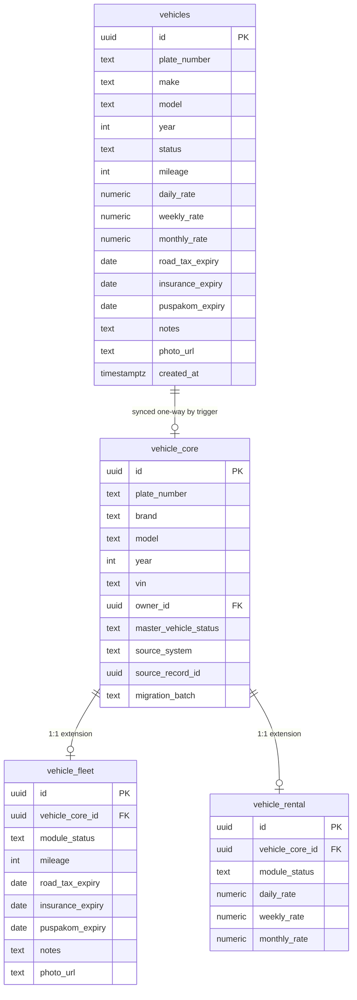

# Vehicle Master Architecture — Phase 1 Impact Report (approved with minor revision)

> ⚠️ **NOT APPLIED.** Nothing in this report has been run against the live Supabase project (`geykkgepjqelqbkbkuvk`). The SQL referenced below exists only as local files in `dhx-team-mojo`, generated for review. Applying it requires a separate, explicit approval step.

## What this is

Phase 1 of the staged Vehicle Master rollout, in its currently-approved form: introduce `vehicle_core` plus two module extension tables (`vehicle_fleet`, `vehicle_rental`) **alongside** the existing flat `vehicles` table, with zero changes required in `dhx-rental` or `dhx-driver`. Per the approved framing, `vehicle_core` is intended to become the **future source of truth**; `vehicles` is the (untouched) compatibility layer feeding it during this phase.

## This revision

- **`vehicle_driver` removed and deferred**, alongside `vehicle_body_paint`/`vehicle_mygarage`/`vehicle_protect`. Reason given: `drivers ↔ rentals ↔ vehicles` already covers that relationship live; an empty extension table would add schema surface with no consumer.
- **Field ownership confirmed and implemented as real typed columns** (not jsonb):
  - `vehicle_core` — identity: `plate_number`, `brand` (from legacy `make`), `model`, `year`, `master_vehicle_status` (master record lifecycle: active/inactive/archived — kept distinct from the legacy operational status, see Open Item below), `created_at`, `updated_at`. (Also retains `vin`/`chassis_no`/`engine_no`/`owner_id`/lineage columns from the prior round — not flagged for removal.)
  - `vehicle_fleet` — operational data: `mileage`, `road_tax_expiry`, `insurance_expiry`, `puspakom_expiry`, `notes`, `photo_url`.
  - `vehicle_rental` — commercial data: `daily_rate`, `weekly_rate`, `monthly_rate`.
  - Column types were confirmed against the live `vehicles` schema via a read-only Supabase lookup (not inferred): `mileage integer`, `daily_rate`/`weekly_rate`/`monthly_rate numeric`, `road_tax_expiry`/`insurance_expiry`/`puspakom_expiry date`, `notes`/`photo_url text`.
  - `module_status` is kept on both extension tables alongside the new data columns, to track per-module assignment state (a vehicle can be active in Fleet but paused in Rental, etc.) — not explicitly called out in the field lists, but central to the module-assignment business rule from the original request; flag if this should be removed.
- **Sync direction reconfirmed one-way only**: `vehicles → vehicle_core/extensions`. Nothing writes back to `vehicles`.

## Open item (flagged, not silently resolved)

`vehicle_core` is described as owning a `status` field. The live `vehicles.status` column holds operational availability states (`available`/`rented`/`maintenance`/`inactive`), whereas `vehicle_core.master_vehicle_status` is a separate, simpler master-record lifecycle (`active`/`inactive`/`archived`) from the prior approved round. I've kept `master_vehicle_status` as-is rather than renaming or replacing it — flag if "status" was meant to replace it with the legacy four-value set instead.

## Files in this delivery

| File | Purpose |
|---|---|
| `supabase/migrations/20260618120000_vehicle_core_phase1.sql` | Creates `vehicle_core` (+ lineage columns), `vehicle_fleet`, `vehicle_rental` (each now with real typed data columns); grants + RLS + `updated_at` triggers; one-time backfill from `vehicles`; one-way sync trigger |
| `supabase/migrations/20260618120100_vehicle_core_compat_view.sql` | Read-only `vehicle_master_view` — reads fleet/rental fields directly from the new tables; still surfaces `vehicles.status` as `legacy_status` for reference since the new tables have no equivalent yet |
| `vehicle-core-rollback.sql` (repo root, **not** in `supabase/migrations/`) | Drops everything Phase 1 creates, in dependency-safe order |

## ERD

## Who is affected

**No one, if left unapplied — and no app code, even once applied.**

- `dhx-rental` and `dhx-driver` keep reading/writing `public.vehicles` exactly as today. Neither repo needs a code change in Phase 1.
- `dhx-team-mojo` itself doesn't query `vehicle_core` yet either — Phase 1 only lays the tables down and keeps them in sync. Wiring any UI to them is Phase 3+ (dual write), not this phase.

## What's deferred (not in this delivery)

- `vehicle_driver`, `vehicle_body_paint`, `vehicle_mygarage`, `vehicle_protect` — no live data/app exists for these yet.
- A dedicated `vehicle_service`/"Ops" table — folded into `vehicle_fleet` instead.
- Phase 2 (frontend reads from compat views), Phase 3 (dual write from new screens), Phase 4 (cutting `dhx-rental`/`dhx-driver` over), Phase 5 (dropping duplicated columns from `vehicles`) — all later, separately-approved steps.
- Two known governance side-findings from earlier investigation, intentionally not actioned here: an orphaned second Supabase project (`guybfeqqrawmkpthsxjh`, pre-rename name) in the same org, and a stale claim in `shared-entities.md` that `profiles` has "no role column" (the column exists; only a constraint was dropped).

## Before applying (separate approval step, not part of this delivery)

1. Review the SQL files above line by line, including the open item on `vehicle_core.master_vehicle_status` vs. the legacy four-value `status`.
2. Confirm in writing that Phase 1 (this revision) should be applied to `geykkgepjqelqbkbkuvk`.
3. Apply via the Supabase CLI / migration tooling — not part of this pass.
