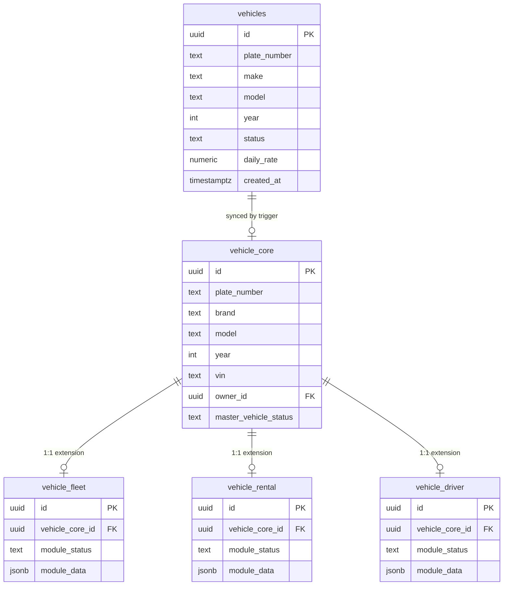

# Vehicle Master Architecture — Phase 1 Impact Report

> ⚠️ **NOT APPLIED.** Nothing in this report has been run against the live Supabase project (`geykkgepjqelqbkbkuvk`). The SQL referenced below exists only as local files in `dhx-team-mojo`, generated for review. Applying it requires a separate, explicit approval step.

## What this is

Phase 1 of the staged Vehicle Master rollout you approved: introduce a normalized `vehicle_core` + per-module extension layer **alongside** the existing flat `vehicles` table, with zero changes required in `dhx-rental` or `dhx-driver`.

## Files in this delivery

| File | Purpose |
|---|---|
| `supabase/migrations/20260618120000_vehicle_core_phase1.sql` | Creates `vehicle_core`, `vehicle_fleet`, `vehicle_rental`, `vehicle_driver`; grants + RLS + `updated_at` triggers; one-time backfill from `vehicles`; sync trigger to keep new tables current going forward |
| `supabase/migrations/20260618120100_vehicle_core_compat_view.sql` | Read-only `vehicle_master_view` — joins `vehicle_core` with all three extensions for any future consumer that wants the full picture |
| `vehicle-core-rollback.sql` (repo root, **not** in `supabase/migrations/`) | Drops everything Phase 1 creates, in dependency-safe order. Run manually if Phase 1 is ever applied and needs reverting. |

## ERD

`vehicles` is shown as the untouched legacy block. It feeds `vehicle_core` one-way, via the sync trigger — nothing flows back.

## Who is affected

**No one, if left unapplied — and no app code, even once applied.**

- `dhx-rental` and `dhx-driver` keep reading/writing `public.vehicles` exactly as today. Neither repo needs a code change in Phase 1.
- `dhx-team-mojo` itself doesn't query `vehicle_core` yet either — Phase 1 only lays the table down and keeps it in sync. Wiring any UI to it is Phase 3+ (dual write), not this phase.

## What's deferred (not in this delivery)

- `vehicle_body_paint`, `vehicle_mygarage`, `vehicle_protect` — no live data/app exists for these yet; stay business concepts per your Phase 4 answer.
- A dedicated `vehicle_service`/"Ops" table — folded into `vehicle_fleet.module_data` instead (see Design Decision #4 in the plan); flag if "Ops" was meant to be a distinct module.
- Phase 2 (frontend reads from compat views), Phase 3 (dual write from new screens), Phase 4 (cutting `dhx-rental`/`dhx-driver` over), Phase 5 (dropping duplicated columns from `vehicles`) — all later, separately-approved steps.
- Two known governance side-findings from this investigation, intentionally not actioned here: an orphaned second Supabase project (`guybfeqqrawmkpthsxjh`, pre-rename name) in the same org, and a stale claim in `shared-entities.md` that `profiles` has "no role column" (the column exists; only a constraint was dropped).

## Before applying (separate approval step, not part of this delivery)

1. Review the SQL files above line by line.
2. Confirm in writing that Phase 1 should be applied to `geykkgepjqelqbkbkuvk`.
3. Apply via the Supabase CLI / migration tooling — not part of this pass.
